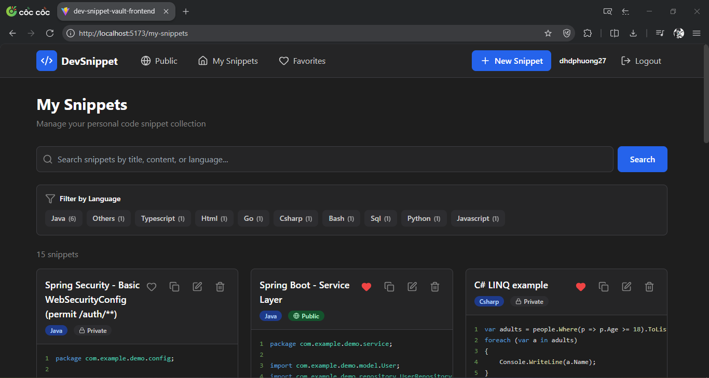
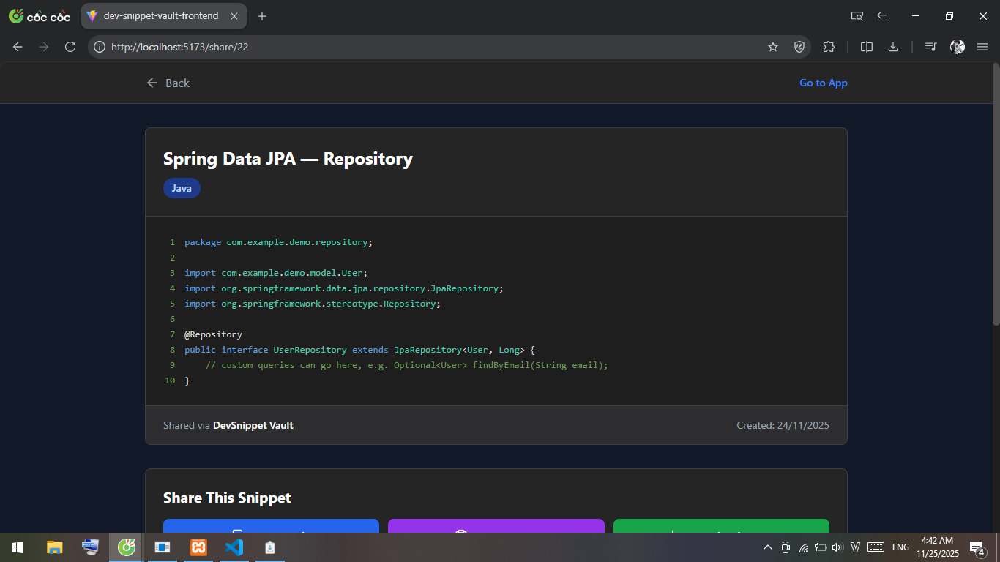
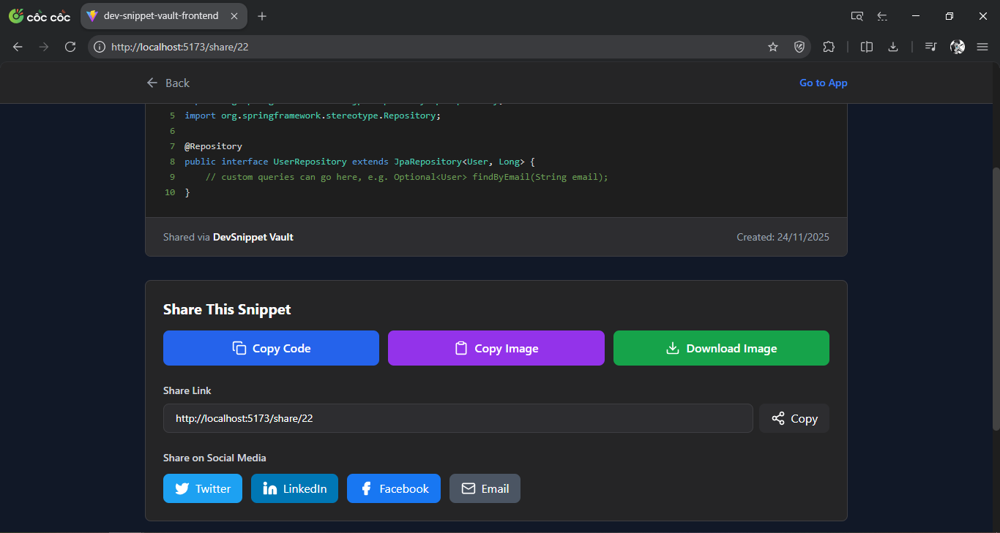
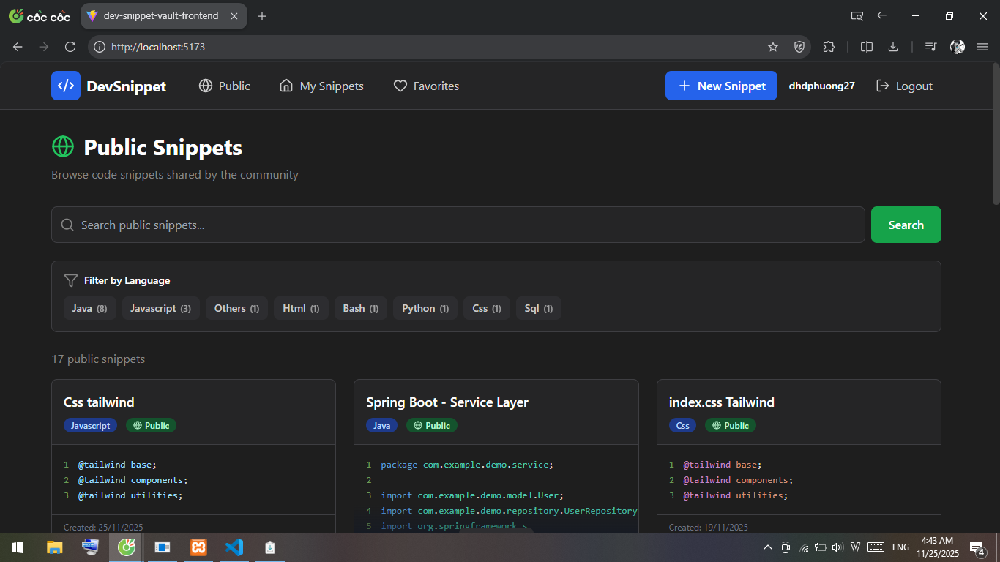
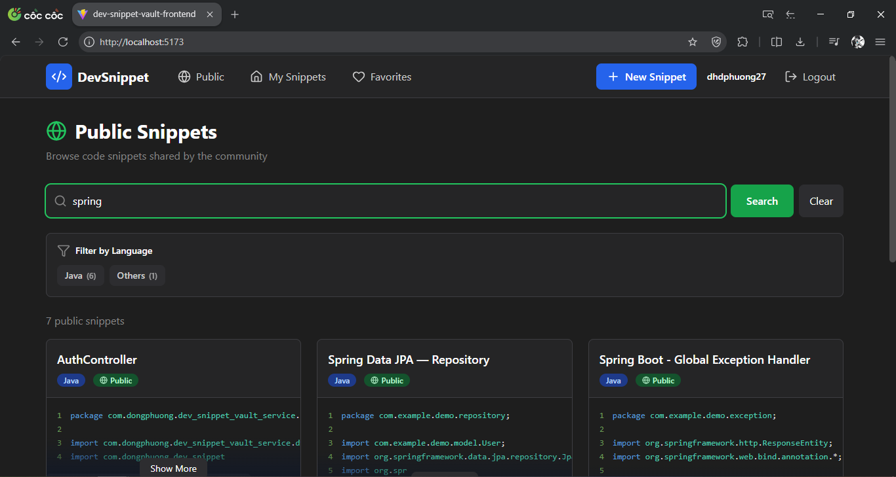
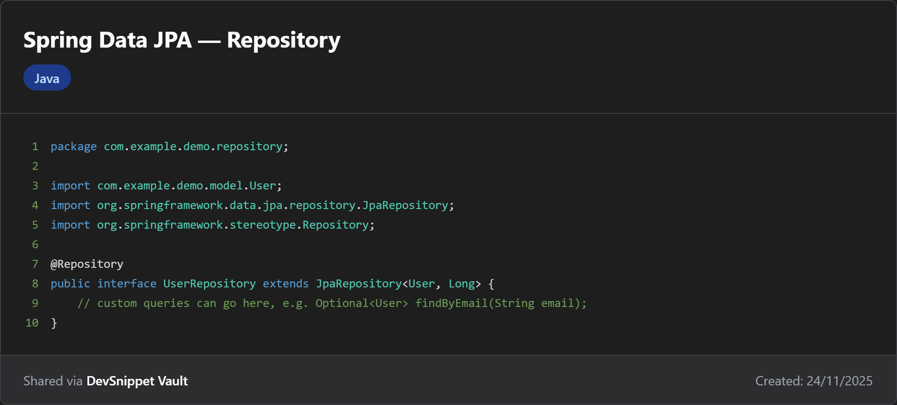

# DevSnippet Vault

A modern, full-stack code snippet management application built with React and Spring Boot. Store, organize, and share your code snippets with a beautiful dark-themed interface inspired by VS Code.


## Table of Contents

- [Screenshots](#screenshots)
- [Features](#features)
- [Technology Stack](#technology-stack)
- [Architecture](#architecture)
- [Getting Started](#getting-started)
- [API Endpoints](#api-endpoints)
- [Security Features](#security-features)
- [What I Learned](#what-i-learned)
- [Future Enhancements](#future-enhancements)

---

## Screenshots

### Dashboard - My Snippets

*Manage your personal code snippet collection with syntax highlighting*

### Create & Edit Snippets

*Intuitive editor with language selection and tag support*

### Share Page


*Share snippets with copy code, copy image, and social media buttons*

### Public Gallery

*Browse and discover code snippets shared by the community*

### Search & Filter

*Powerful search and language filtering capabilities*

### Snippet Image

*Snippet image created by this app*

---

## Features

### Core Functionality
- User Authentication - Secure JWT-based authentication system
- CRUD Operations - Create, read, update, and delete code snippets
- Syntax Highlighting - Beautiful code display with 20+ programming language support
- Favorites System - Mark important snippets for quick access
- Public/Private Snippets - Control snippet visibility and sharing
- Tag Management - Organize snippets with custom tags and autocomplete
- Advanced Search - Search by title, content, or language across your snippets
- Language Filtering - Filter snippets by programming language with usage counts
- Copy to Clipboard - One-click code copying functionality
- Responsive Design - Seamless experience on desktop, tablet, and mobile devices

### Sharing Features
- Shareable Links - Generate public links for any snippet
- Copy Image - Copy snippet as image to clipboard for sharing
- Download Image - Download high-quality PNG images of code snippets
- Social Media Integration - Direct sharing to Twitter, LinkedIn, Facebook, and Email
- No Login Required - Public snippets accessible without authentication

### UI/UX Highlights
- VS Code-inspired dark theme with custom color palette
- Real-time updates with Vite hot module replacement
- Mobile-responsive masonry layout (Pinterest-style)
- Lightning-fast performance with optimized bundle sizes
- Smooth animations and transitions throughout the app
- Toast notifications for user feedback

---

## Technology Stack

### Frontend
- **React 18** - Modern UI library with hooks
- **Vite** - Next-generation frontend build tool
- **Tailwind CSS** - Utility-first CSS framework
- **React Router v6** - Declarative client-side routing
- **Axios** - Promise-based HTTP client
- **React Syntax Highlighter** - Syntax highlighting for code blocks
- **html-to-image** - Convert DOM nodes to images
- **react-share** - Social media share buttons
- **React Hot Toast** - Beautiful toast notifications
- **Lucide React** - Modern icon library

### Backend
- **Spring Boot 3.5.7** - Java application framework
- **Spring Security** - Authentication and authorization
- **Spring Data JPA** - Data persistence layer
- **MySQL 8.0** - Relational database
- **JWT (JJWT 0.12.5)** - JSON Web Token implementation
- **Lombok** - Reduce boilerplate code
- **Maven** - Build automation and dependency management

### Development Tools
- **Git** - Version control
- **Postman** - API testing
- **VS Code** - Code editor
- **IntelliJ IDEA** - Java IDE

---

## Architecture

### Frontend Architecture
```
src/
├── components/         # Reusable UI components
│   ├── Navbar.jsx           # Navigation bar with auth state
│   ├── SnippetCard.jsx      # Individual snippet display card
│   ├── LanguageFilter.jsx   # Language filtering component
│   └── TagInput.jsx         # Tag input with autocomplete
├── pages/             # Full page components
│   ├── Login.jsx            # User login page
│   ├── Register.jsx         # User registration page
│   ├── Home.jsx             # My snippets dashboard
│   ├── CreateSnippet.jsx    # Create/edit snippet form
│   ├── Favorites.jsx        # Favorited snippets page
│   ├── PublicSnippets.jsx   # Public gallery page
│   └── ShareSnippet.jsx     # Public share page
├── services/          # API integration layer
│   └── api.js               # Axios configuration and endpoints
├── context/           # Global state management
│   └── AuthContext.jsx      # Authentication context provider
└── utils/             # Helper functions and utilities
```

### Backend Architecture
```
src/main/java/
├── controller/        # REST API endpoints
│   ├── AuthController       # Authentication endpoints
│   ├── SnippetController    # Snippet CRUD operations
│   └── TagController        # Tag management
├── service/           # Business logic layer
│   ├── impl/
│   │   ├── AuthServiceImpl
│   │   ├── SnippetServiceImpl
│   │   └── TagServiceImpl
│   ├── AuthService
│   ├── SnippetService
│   └── TagService
├── repository/        # Data access layer
│   ├── UserRepository       # User database operations
│   ├── SnippetRepository    # Snippet database operations
│   └── TagRepository        # Tag database operations
├── entity/            # JPA entities
│   ├── User                 # User entity with relationships
│   ├── Snippet              # Snippet entity
│   ├── Tag                  # Tag entity
│   └── Auditable           # Base entity with timestamps
├── dto/               # Data transfer objects
│   ├── UserDTO
│   ├── SnippetDTO
│   ├── CreateSnippetRequest
│   ├── AuthRequest
│   └── AuthResponse
├── security/          # Security configuration
│   ├── JwtUtil             # JWT token generation/validation
│   ├── JwtFilter           # JWT authentication filter
│   ├── CustomUserDetailsService
│   └── SecurityConfig      # Spring Security configuration
└── config/            # Application configuration
    ├── CorsConfig          # CORS configuration
    └── SecurityConfig      # Additional security settings
```

### Database Schema
```
Users (id, username, email, password, role, created_at, updated_at)
  ↓ One-to-Many
Snippets (id, title, content, language, is_public, is_favorite, user_id, created_at, updated_at)
  ↓ Many-to-Many
Tags (id, name)
```

---

## Getting Started

### Prerequisites
- Node.js 18+ and npm
- Java 21+
- Maven 3.8+
- MySQL 8.0+

### Backend Setup

**1. Clone the repository**
```bash
git clone https://github.com/yourusername/dev-snippet-vault.git
cd dev-snippet-vault
```

**2. Configure MySQL database**

Create a new database:
```sql
CREATE DATABASE dev_snippet_vault;
```

**3. Configure application properties**

Update `src/main/resources/application.properties`:
```properties
# Database Configuration
spring.datasource.url=jdbc:mysql://localhost:3306/dev_snippet_vault?createDatabaseIfNotExist=true
spring.datasource.username=your_username
spring.datasource.password=your_password
spring.datasource.driver-class-name=com.mysql.cj.jdbc.Driver

# JPA/Hibernate Configuration
spring.jpa.hibernate.ddl-auto=update
spring.jpa.show-sql=true
spring.jpa.properties.hibernate.dialect=org.hibernate.dialect.MySQLDialect

# JWT Configuration
app.jwt.secret=your-secret-key-min-256-bits-long-change-in-production
app.jwt.expiration=86400000

# Server Configuration
server.port=8080
```

**4. Run the backend server**
```bash
./mvnw spring-boot:run
```
Backend will start on `http://localhost:8080`

### Frontend Setup

**1. Navigate to frontend directory**
```bash
cd dev-snippet-vault-frontend
```

**2. Install dependencies**
```bash
npm install
```

**3. Start development server**
```bash
npm run dev
```
Frontend will start on `http://localhost:5173`

**4. Build for production**
```bash
npm run build
```

---

## API Endpoints

### Authentication
```
POST   /api/auth/register          Register new user
POST   /api/auth/login             Authenticate user and get JWT token
```

### Snippets (Authenticated)
```
GET    /api/snippets/my            Get current user's snippets
POST   /api/snippets               Create new snippet
PUT    /api/snippets/{id}          Update snippet by ID
DELETE /api/snippets/{id}          Delete snippet by ID
PATCH  /api/snippets/{id}/favorite Toggle favorite status
GET    /api/snippets/favorites     Get user's favorite snippets
GET    /api/snippets/search        Search user's snippets by keyword
```

### Public Snippets (No Auth Required)
```
GET    /api/snippets/public            Get all public snippets
GET    /api/snippets/public/{id}       Get single public snippet by ID
GET    /api/snippets/public/search     Search public snippets by keyword
```

### Tags
```
GET    /api/tags                   Get current user's tags with usage counts
GET    /api/tags/popular          Get popular tags across all users
```

## Security Features

- **JWT Authentication** - Stateless token-based authentication for scalability
- **Password Encryption** - BCrypt hashing algorithm for secure password storage
- **CORS Configuration** - Properly configured cross-origin resource sharing
- **Protected Routes** - Frontend route guards redirect unauthenticated users
- **Token Expiration** - Automatic session management with token expiration (24 hours)
- **SQL Injection Prevention** - JPA parameterized queries prevent SQL injection attacks
- **XSS Protection** - React automatically escapes rendered content
- **Authorization Checks** - Backend verifies user ownership before allowing modifications

---


## Performance Optimizations

- **Code Splitting** - React lazy loading reduces initial bundle size
- **Tree Shaking** - Tailwind CSS purges unused styles (final size: 5-15KB)
- **Image Optimization** - html-to-image generates optimized PNGs
- **Lazy Loading** - Components and routes load on demand
- **Debounced Search** - Reduces unnecessary API calls during user input
- **HTTP Caching** - Browser caches static assets for faster subsequent loads
- **Gzip Compression** - Reduces data transfer size by 70-80%
- **JPA Lazy Loading** - Related entities load only when accessed
- **Connection Pooling** - Database connection reuse improves performance
- **Index Optimization** - Database indexes on frequently queried columns

---

## What I Learned

Building this full-stack application taught me valuable skills across the entire development stack:

### Frontend Development
- **React Fundamentals** - Mastered component lifecycle, hooks (useState, useEffect, useContext), and React Router for navigation
- **State Management** - Implemented global authentication state using Context API without external libraries
- **API Integration** - Built a clean API service layer with Axios interceptors for token handling
- **Modern CSS** - Gained proficiency in Tailwind's utility-first approach and responsive design patterns
- **Form Handling** - Implemented controlled components with validation and error handling
- **File Operations** - Worked with the FileReader API and clipboard API for advanced features

### Backend Development
- **RESTful API Design** - Created clean, maintainable endpoints following REST principles
- **Spring Security** - Implemented JWT-based authentication with custom filters and security configurations
- **JPA/Hibernate** - Modeled complex database relationships (One-to-Many, Many-to-Many) and optimized queries
- **DTO Pattern** - Separated API contracts from database entities for better maintainability
- **Service Layer Architecture** - Organized business logic separate from controllers and repositories
- **Exception Handling** - Implemented global exception handlers for consistent error responses

### Database Design
- **Relational Modeling** - Designed normalized database schema with proper relationships
- **Query Optimization** - Used JPA methods and custom queries for efficient data retrieval
- **Data Integrity** - Implemented cascading operations and orphan removal
- **Indexing Strategy** - Added indexes on frequently queried columns for performance

### DevOps & Tools
- **Build Tools** - Configured Maven for backend and Vite for frontend builds
- **Version Control** - Followed Git best practices with feature branches and clear commit messages
- **CORS Configuration** - Properly configured cross-origin requests between frontend and backend
- **Environment Management** - Separated development and production configurations

### Problem Solving
- **Debugging** - Learned to use browser DevTools and backend logging effectively
- **Error Handling** - Implemented user-friendly error messages and fallback mechanisms
- **Performance Issues** - Identified and resolved performance bottlenecks
- **Browser Compatibility** - Handled clipboard API differences across browsers

---

## Future Enhancements

- Markdown support for snippet descriptions and documentation
- Direct snippet sharing via QR codes
- Collaborative editing with real-time synchronization
- Snippet versioning and revision history
- Export snippets to various formats (JSON, GitHub Gist)
- Browser extension for quick snippet saves from any webpage
- Multiple syntax highlighting themes (light/dark modes)
- Comment system for public snippets
- Analytics dashboard with usage statistics
- Multi-language support (internationalization)
- Code execution environment (sandbox)
- Snippet collections/folders for better organization
- Advanced tagging with hierarchical categories
- Integration with GitHub, GitLab, Bitbucket
- API rate limiting and usage quotas

---

## Contributing

Contributions are welcome! Please follow these steps:

1. Fork the repository
2. Create a feature branch (`git checkout -b feature/AmazingFeature`)
3. Commit your changes (`git commit -m 'Add some AmazingFeature'`)
4. Push to the branch (`git push origin feature/AmazingFeature`)
5. Open a Pull Request

---

## License

This project is licensed under the MIT License - see the LICENSE file for details.

---

## Author

Đặng Hoàng Đông Phương

- GitHub: [@dhdphuong27](https://github.com/dhdphuong27)
- LinkedIn: [DongPhuongDangHoang](https://linkedin.com/in/dhdongphuong)
- Email: dhdongphuong27@gmail.com

---

## Acknowledgments

- React Documentation - https://react.dev/
- Spring Boot Documentation - https://spring.io/projects/spring-boot
- Tailwind CSS - https://tailwindcss.com/
- Prism Syntax Highlighter - https://prismjs.com/
- Lucide Icons - https://lucide.dev/
- React Syntax Highlighter - https://github.com/react-syntax-highlighter/react-syntax-highlighter
- html-to-image - https://github.com/bubkoo/html-to-image
- React Share - https://github.com/nygardk/react-share

Special thanks to the open-source community for their invaluable tools and resources.

---

**Made with dedication by Dong Phuong**

**If you found this project helpful, please consider giving it a star!**
```
